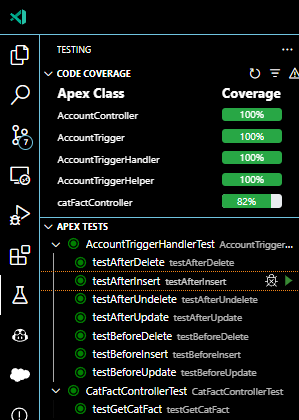

# Account Trigger & Opportunities List & Cat Fact Lightning Web Component


This project includes:

1. Account Trigger with Opportunities Creation: A robust trigger for the Account object. Upon creating an Account, it dynamically generates related Opportunities with pre-defined values.

2. Cat Fact Lightning Web Component (LWC): Introducing catFactComponent, a visually appealing Lightning Web Component that fetches and displays intriguing cat facts using the `https://catfact.ninja/` API. Placed prominently on the Account record page, it adds a touch of feline fascination to your Salesforce platform.

3. Opportunities List Lightning Web Component: Behold OpportunitiesList, a standard controller-powered list showcasing related Opportunities on the Account record page. Elegant and conveniently positioned on the left-hand side, it provides users with a quick overview of associated Opportunities.

4. Extensive class testing covering 95% of the org's Apex codebase.

 

## Components Showcase

### CatFactComponent

- A Lightning Web Component (`catFactComponent`) that curates a daily dose of random cat facts on the Salesforce platform thanks to the Cat Facts REST API. Positioned on the right-hand side of the Account record page, it offers users a break from the routine.

### CatFactController

- An Apex class (`catFactController`) with a method (`getCatFact`) that makes a callout to the 'https://catfact.ninja/' API to retrieve a random cat fact.

### OpportunitiesList

- A standard-controller-powered list that displays related Opportunities in the Account record page. It was placed in the left-hand side. 


## Installation

To deploy this project to your Salesforce org:

1. Clone this repository:

   ```bash
   git clone https://github.com/your-username/cat-fact-lwc.git
   ```

2. Assign the Lightning Web Component to the desired objects, e.g., Account:

    ```bash
    sfdx force:source:deploy -m LightningRecordPage:Account-Record_Page
    ```

## Usage

1. Add the catFactComponent to your Lightning Record Page for the desired object (e.g., Account).

2. Visit a record page for the specified object to see the random cat fact.

## License

This project is licensed under the MIT License - see the LICENSE file for details.

